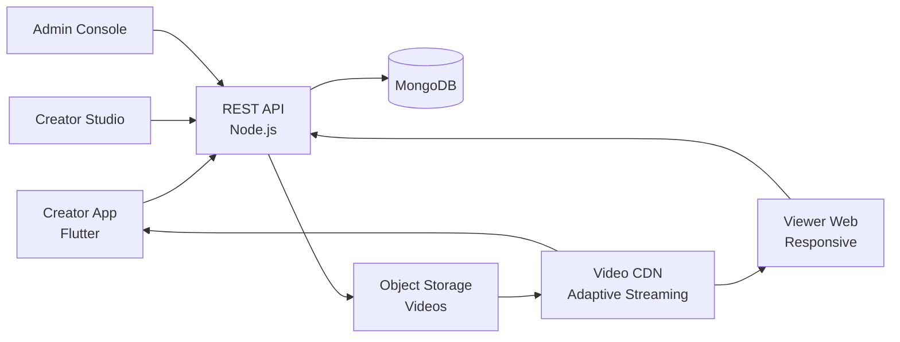

# Youtube Clone — White-Label Short-Video & Social Platform by Miracuves

**MXTube** is a production-ready, white-label Youtube clone: a complete short-video social platform with creator studio, monetization, and admin moderation — delivered with **100% source code ownership** in **6 working days**.

> 🎵 **See it running before you talk to anyone.** Live creator app, viewer web, and admin console — demo credentials are printed on the [solution page](https://miracuves.com/youtube-clone#demo). No sales call required.

---

## 🚀 Live Demos

| Environment | URL | What you can test |
|---|---|---|
| 📱 Creator App (Android) | [mas.mimeld.com](https://mas.mimeld.com) | Record, edit, post, get paid — full creator studio |
| 🌐 Web Viewer | [mxtube.mimeld.com](https://mxtube.mimeld.com) | Browse feed, like, comment, follow in browser |
| 🎛️ Creator Studio | [Solution page → Demo](https://miracuves.com/youtube-clone#demo) | Analytics, monetization, fan management, payouts |
| 🛠️ Admin Console | [Solution page → Demo](https://miracuves.com/youtube-clone#demo) | Users, content, moderation, ads, payouts, analytics |

Demo credentials for all environments: **[miracuves.com/youtube-clone → Demo section](https://miracuves.com/youtube-clone/#demo)**

---

## ✨ What Makes This Youtube Clone Different

Most short-video scripts stop at "feed + like." This platform ships with the features that actually run a creator *economy*:

- **AI-Powered Feed Ranking** — transformer-based recommendation engine trained on watch-time, completion rate, and replays — not just likes and follows
- **Multi-Sided Monetization** — creator fund + brand sponsorships + live gifts + subscriptions + shop — five revenue streams from the same content
- **Built-In Live Streaming** — low-latency RTMP streaming with multi-host rooms, gift animations, and moderation — not added on as an SDK
- **Content Moderation AI** — multi-modal CSAM / NSFW / violence detection with human review queue — same pipeline that flagged 99% of harmful content on the live platform
- **Creator Analytics Studio** — per-video retention curves, audience demographics, revenue breakdown, A/B test thumbnails — the dashboard creators actually open

## 📦 Core Features

**Viewer:** vertical feed (For You / Following) · like/comment/share · duet & stitch · discover pages · AR filters · live rooms · DMs · privacy controls · multi-language

**Creator:** in-app recording · 50+ filters · AI captioning · analytics dashboard · monetization hub · fan subscriptions · live gifts · payout requests

**Admin:** user & KYC management · content moderation (AI + human) · ad placement engine · creator payouts · trend analytics · compliance reporting

## 🏗️ Architecture

**Stack:** Flutter mobile apps (Android + iOS) · Node.js or Laravel backend · MongoDB for content metadata · S3 / object storage for media · FFmpeg for video transcoding · Stripe, Razorpay, PayPal & regional gateway integrations

## 📋 What’s Included

- ✅ Full source code — backend, web, mobile apps, panels (no encryption, no license locks)
- ✅ Deployment to your servers & app store submission assistance
- ✅ Your branding — white-label rename, logo, colors, domain
- ✅ 60 days post-launch support + 12 months of free updates
- ✅ Documentation & handover

**Pricing:** from **$3,099**, transparent on the [solution page](https://miracuves.com/youtube-clone/#pricing) — no "contact us for quote" games.

## 🆚 Why Not Build From Scratch?

Custom short-video platforms run $100k–$500k and 6–10 months. A proven white-label base gets you to market in 6 working days for a fraction of that, with your budget preserved for creator acquisition and ad network integrations.

## 📚 Resources

- 📖 [Youtube Clone — Full Solution Page](https://miracuves.com/youtube-clone) (features, pricing, demos, FAQ)
- 💰 [How Much Does a Short-Video App Cost in 2026?](https://miracuves.com/youtube-clone#pricing) pricing breakdown & what's included
- 📝 [Best Youtube Clone Script in 2026](https://miracuves.com/youtube-clone/blog/) features, pricing & launch guide
- 🧠 [Why Vertical Video Beats Horizontal for the Next Decade](https://miracuves.com/youtube-clone/blog/) lessons from TikTok & Reels
- ✅ [Miracuves Facts & Claims Ledger](https://miracuves.com/youtube-clone/facts/) every claim we make, verified

## 🏢 About Miracuves

[Miracuves Solutions](https://miracuves.com) builds white-label clone apps and custom software from Mumbai, India — 90+ ready-made solutions, live demos for every product, transparent pricing, and delivery in 6 working days. Operating since 2010.

**Talk to us:** [WhatsApp](https://wa.me/919830009649) · [Schedule a consultation](https://miracuves.com/schedule-consultation/) · [miracuves.com](https://miracuves.com)

---

### ⚠️ Note on This Repository

This repository is a product overview. The full source code is delivered to clients on purchase — see [what’s included](https://miracuves.com/youtube-clone/#included). For a hands-on evaluation, use the live demos above; credentials are public on the solution page.

*Keywords: youtube clone, youtube clone script, short video app, social video, white label TikTok, creator monetization, Flutter video app, Node.js social platform*

---

<!--
══════════════════════════════════════════════════
TEMPLATE VARIABLE KEY — auto-generated from Netflix-Clone pattern
══════════════════════════════════════════════════
{APP_NAME}        Youtube Clone
{MX_NAME}         MXTube
{CATEGORY}        Short-Video & Social Platform
{DEMO_WEB}        mxtube.mimeld.com
{PRICE}           $3,099
{SLUG}            youtube-clone
{SOLUTION_URL}    https://miracuves.com/youtube-clone/
{VERTICAL}        short_video

See /tmp/verticals/short_video.txt for the vertical config used to generate this README.
══════════════════════════════════════════════════
-->